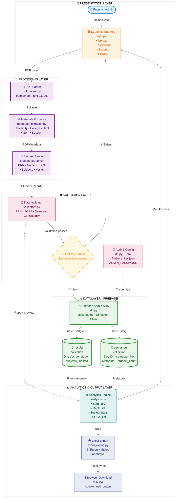

# ResultOps 🎓

**ResultOps** is a robust, university-grade result processing platform built using **Streamlit** and **Firebase Firestore**. The application is designed to streamline transcript parsing, validation, storage, and analysis for academic institutions affiliated with Savitribai Phule Pune University.

---

## 🚀 Key Features

- **Automated PDF Parsing** — Extracts structured student data from text-based university ledger PDFs using `pdfplumber`.
- **Dynamic Metadata Detection** — Automatically identifies university, college, department, session, and semester — zero hardcoding.
- **Dynamic Subject Detection** — Subject codes are detected at runtime; no manual configuration required.
- **Duplicate Protection** — Prevents re-upload of the same semester to maintain data integrity.
- **Pre-save Validation** — Checks consistency of SGPA, PRN, and subject counts before any database write.
- **Analytics Dashboard** — Comprehensive metrics: pass/fail stats, SGPA distribution, subject-wise analytics, and ranked student lists.
- **Instant Excel Export** — Download a styled 5-sheet workbook directly from the Upload page — no database required.
- **History Management** — View, audit, and admin-delete previously uploaded semesters.
- **Firebase Backend** — Powered by Google Firebase Firestore; reliable, fast, and reachable from any network.

---

## 🗂️ Project Structure

```
ResultOps/
├── app.py                      # Streamlit multi-page application entry point
├── firebase_key.json           # Firebase service account key (NOT committed to git)
├── .env                        # Environment variables (NOT committed to git)
├── .env.example                # Template for environment variables
├── requirements.txt            # Python dependencies
├── test_connection.py          # Firebase connectivity test script
├── GUIDE.md                    # Step-by-step Firebase setup and usage guide
│
├── parser/                     # PDF extraction and parsing logic
│   ├── pdf_parser.py           # Text extraction via pdfplumber
│   ├── metadata_extractor.py   # Detects university/college/dept/session/semester
│   └── student_parser.py       # Parses individual student records dynamically
│
├── database/                   # Database connection
│   └── db.py                   # Firebase Admin SDK client (singleton)
│
├── analytics/                  # Reporting and dashboard queries
│   └── analytics.py            # Firestore-based analytics and filter helpers
│
├── services/                   # Business logic
│   ├── result_service.py       # Firestore writes, batch inserts, duplicate guard
│   └── excel_export.py         # Styled multi-sheet Excel workbook generator
│
└── utils/                      # Shared utilities
    └── validators.py           # Pre-save data validation routines
```

---

## 🛠️ Setup Instructions

### 1. Clone the Repository and Install Dependencies

```bash
git clone <your-repo-url>
cd ResultOps
pip install -r requirements.txt
```

### 2. Create a Firebase Project

1. Go to [console.firebase.google.com](https://console.firebase.google.com)
2. Click **Add Project** → name it `ResultOps` → disable Google Analytics → **Create Project**

### 3. Enable Firestore Database

1. In Firebase Console → **Build** → **Firestore Database**
2. Click **Create Database** → **Start in test mode**
3. Select region **asia-south1 (Mumbai)** → **Enable**

### 4. Download Service Account Key

1. Click the ⚙️ gear icon → **Project Settings** → **Service Accounts**
2. Click **Generate new private key** → **Generate Key**
3. Rename the downloaded file to **`firebase_key.json`**
4. Place it in the root `ResultOps/` folder (same level as `app.py`)

> ⚠️ **Never commit `firebase_key.json` to GitHub.** It is already in `.gitignore`.

### 5. Configure Environment Variables

```bash
cp .env.example .env
```

Edit `.env`:

```env
FIREBASE_KEY_PATH=firebase_key.json
ADMIN_PASSWORD=your_secure_password_here
```

### 6. Test the Connection

```bash
python test_connection.py
```

Expected output:
```
✅ Key file found
✅ Firestore connected successfully!
🎉 Everything is working! Run: streamlit run app.py
```

### 7. Launch the Application

```bash
streamlit run app.py
```

Open your browser at **http://localhost:8501**

---

## 🏗️ System Architecture




**Data Flow (Upload Path):**
`PDF Upload → Text Extract → Metadata Detect → Student Parse → Validation → Duplicate Check → Firestore Write → Excel Export`

**Firestore Collections:**

| Collection | Description |
|---|---|
| `semesters` | One document per semester. Doc ID = unique semester key. Stores metadata + student count. |
| `results` | One document per student. Contains PRN, SGPA, status, and `subjects[]` nested array with all marks. |

---

## 📄 PDF Requirements

The platform requires **text-based** (not scanned) ledger PDFs. Each student record should follow this structure:

```
PRN: XXXXX  SEAT NO.: YYY  NAME: Student Name  Mother's Name :- Mother Name
SEMESTER: 4

410241  45  18  20  --  --  83  4  O  10  40
...

Winter Session 2025 SGPA : 8.50  Credits Earned/Total : 24/24
SGPA: (SEM-4) 8.50
```

> **Tip:** Open the PDF in Adobe Reader and try to select text. If you can select it, it will work with ResultOps.

---

## 🔒 Environment Variables

| Variable | Description |
|---|---|
| `FIREBASE_KEY_PATH` | Path to the Firebase service account JSON key file |
| `ADMIN_PASSWORD` | Password required for destructive admin operations in the History page |

---

## 📥 Excel Report — 5 Sheets

Every report downloaded from ResultOps contains:

| Sheet | Contents |
|---|---|
| **Student Master** | All students with PRN, Seat No, Name, SGPA, Credits, Status, Category |
| **Rank List** | Students sorted by SGPA with Distinction / First Class / Pass labels |
| **Subject Analytics** | Per-subject: Appeared, Passed, Failed, Pass %, Highest, Lowest, Average |
| **SGPA Distribution** | Count of students in each SGPA range |
| **Summary** | Overall semester stats — averages, pass %, distinctions, total subjects |

Reports are available **before and after saving** to the database.

---

## ⚡ Performance Targets

| Operation | Target |
|---|---|
| Parse 100 students from PDF | < 5 seconds |
| Firestore batch insert (100 students) | < 3 seconds |
| Analytics query response | < 1 second |

---

## 🛡️ Security Notes

- Firebase service account key is used server-side only via `firebase-admin` SDK.
- `firebase_key.json` is listed in `.gitignore` — never committed to version control.
- Admin password gates all destructive operations (semester deletion).
- Firestore is set to **test mode** during development — restrict rules before going to production.

---

## 🔧 Troubleshooting

| Error | Fix |
|---|---|
| `FileNotFoundError: firebase_key.json` | Place the key file in the `ResultOps/` folder |
| `Invalid service account certificate` | Re-download the key from Firebase Console |
| `TransportError` / network failure | Check internet connection or switch to mobile hotspot |
| `PermissionDenied` | Set Firestore rules to test mode in Firebase Console |
| `0 students detected` | Ensure PDF is text-based, not a scanned image |
| `Semester not detected` | PDF must contain `SEMESTER: <number>` in the text |

For full setup and troubleshooting details, see **[GUIDE.md](GUIDE.md)**.

---

## 👨‍💻 About the Maintainer

**Himanshu Jadhav**
Second-Year Engineering Student — AI & Data Science

[](https://github.com/himanshu-jadhav108)
[](https://www.linkedin.com/in/himanshu-jadhav-328082339?utm_source=share&utm_campaign=share_via&utm_content=profile&utm_medium=android_app)
[](https://www.instagram.com/himanshu_jadhav_108?igsh=MWYxamppcTBlY3Rl)
[](https://himanshu-jadhav-portfolio.vercel.app/)

---